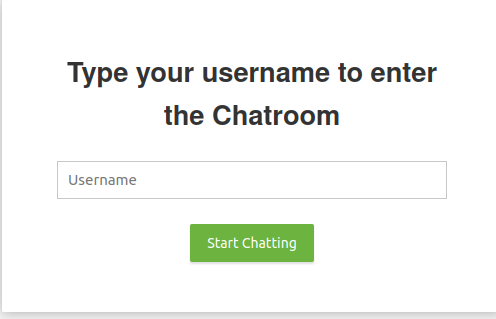
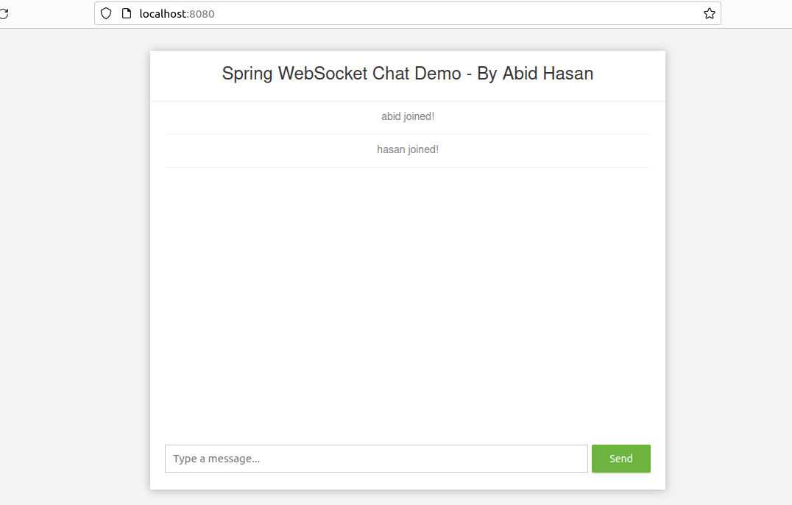

# Real-Time Web Communication App

Welcome to the Real-Time Web Communication App Projects. In this project,  I have simplified complex concepts and guides you through creating a real-time, two-way communication system. We'll start with the basics of WebSocket technology and how it enables seamless data flow between clients and servers. Then, we'll swiftly move into the hands-on coding part.

## What I've Learned

By following this tutorial, you'll achieve:

1. **Clear Understanding of WebSockets:** Get a solid grasp of WebSockets and their crucial role in real-time web applications.
2. **Practical WebSocket Knowledge:** Learn how to establish WebSocket connections in a practical manner.
3. **Real-Time Chat Implementation:** Develop a functional chat application, mastering the art of sending and receiving messages instantly.
4. **Tackling Real Challenges:** Learn to overcome real-world hurdles like connection errors and system failovers.
5. **Best Practices for Security and Scalability:** Discover essential practices for ensuring security and scalability in WebSocket applications.

### Chat application layout 

### Chat application layout after adding user
